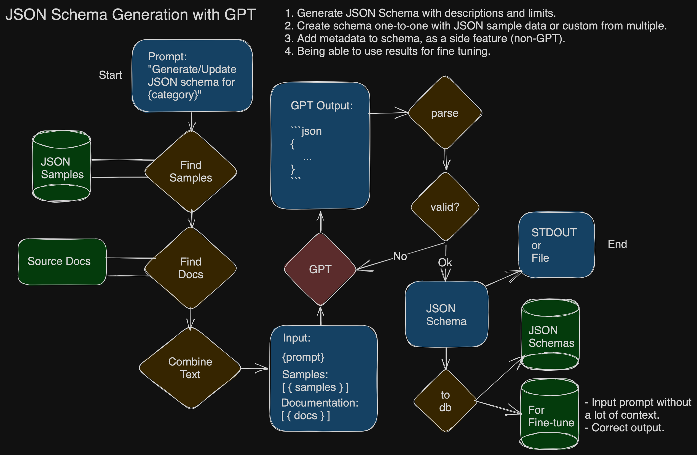

# node-schema-gen

## Intro

Node CLI tool to generate JSON schemas from JSON samples and documentation using GPT. 

1. Infer base JSON schema from JSON samples as any other JSON schema generator.
2. Retrieve documentation about the JSON samples using embeddings.
3. Give GPT the inferred base JSON schema plus documentation.
4. Add instruction / prompt for guiding GPT. Maybe have intermediary calls from GPT itself (chain) to retrieve the additional data instead of writing that into the code.

### Example:

#### User
Can you give me a JSON schema for Cart Create event from Shopify?

#### GPT
*Function calls to retrieve Cart Create samples and Cart Create docs*

#### Node / System
*Combines the output from function call with altered prompt / instruction*

#### GPT
Sure, here it is a JSON schema for Cart Create:

```json
{
    "type": "object",
    "properties": {
        "etc": {}
    }
}
```

#### Node / System

*Parses output and stores in database*


## Flow




## Notes

This is mostly inspired from the need of generating JSON schemas for data validation, but also GPT uses schemas for function calling so this can expand on that and generate schemas not only from JSON samples, but also from different contexts, like file directories or config files.

## Tech Stack

1. Node JS with TypeScript
2. Zod for validation / schema generation.
3. Either Postgres or Redis for storage and vector search.
4. OpenAI SDK.
